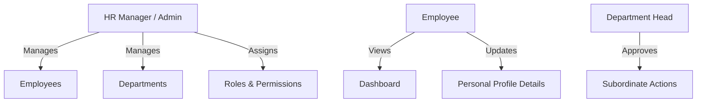

# Business Requirements Document (BRD)

This document outlines the high-level business goals, target audience, system actors, scope, and core use cases for the Enterprise Workforce Management System (EWMS).

---

## 1. Project Overview & Business Value

In many scaling enterprises, managing employee information, tracking leave balances, recording attendance, and conducting performance reviews are handled via fragmented spreadsheets or isolated tools. This leads to operational inefficiencies, data silos, tracking errors, and compliance risks.

The **Enterprise Workforce Management System (EWMS)** addresses these challenges by providing a unified, secure, and modern platform for:
1. **Centralizing HR Data**: A single source of truth for employees, departments, and roles.
2. **Automating Workflows**: Streamlining leave application, manager approvals, and attendance calculations.
3. **Enhancing Auditing**: Tracking historical changes to user roles, employee records, and approvals.
4. **Providing Insights**: Offering real-time workforce metrics (employee ratios, upcoming events, leave balances) on a central dashboard.

---

## 2. Business Goals
- **Operational Efficiency**: Reduce the administrative time spent by HR managers tracking leaves and employee records by at least 40%.
- **Single Source of Truth**: Eliminate duplicate employee lists across departments.
- **Audit Preparedness**: Establish a 100% reliable log of all system security modifications (RBAC) and employee status updates.
- **Scalability & Security**: Design the system to handle up to 5,000 active employees with secure, granular permission control.

---

## 3. System Scope

### In-Scope (MVP Phase 1)
- Centrally manage employees, departments, and roles.
- Expose a visual dashboard representing employee distribution and upcoming events.
- Enforce granular role-based permissions (RBAC).

### In-Scope (Future Sprints)
- Leave management requests and approval workflows.
- Daily check-in/check-out attendance tracking.
- AI-driven analytics (semantic search, leave pattern summaries, resume analysis).
- Docker and cloud deployment capabilities.

### Out of Scope
- Financial accounting systems (except basic payroll tracking in later phases).
- Direct integration with physical gate-swipe hardware (replaced by web check-in/out).

---

## 4. System Actors & Roles

### Actor Profiles
1. **System Administrator / HR Manager**:
   - High-privilege user responsible for directory management, creating employee records, setting up departments, and assigning roles/permissions.
2. **Department Head (Manager)**:
   - Mid-privilege user who supervises a specific department, reviews requests from department members, and views department metrics.
3. **General Employee (Staff)**:
   - Low-privilege user who can view their profile, see department directory information, submit requests, and check dashboard events.

---

## 5. High-Level Use Cases (MVP Focus)

### Use Case 1: Manage Employee Lifecycle
- **Actor**: HR Manager
- **Goal**: Register new employees, update details (salary, contacts, job titles), transition status (active, probation, terminated), and delete/archive records.
- **Preconditions**: HR Manager is authenticated and has `Employee.Write` permission.

### Use Case 2: Organize Department Hierarchy
- **Actor**: HR Manager
- **Goal**: Create and structure departments (e.g., Engineering, HR, Finance) and assign department heads.
- **Preconditions**: HR Manager is authenticated and has `Department.Write` permission.

### Use Case 3: View Workforce Metrics (Dashboard)
- **Actor**: All Actors (with adjusted visibility)
- **Goal**: View active employee counts, department breakdowns, and upcoming events (e.g., birthdays, work anniversaries).
- **Preconditions**: Actor is authenticated and has access to the dashboard.
