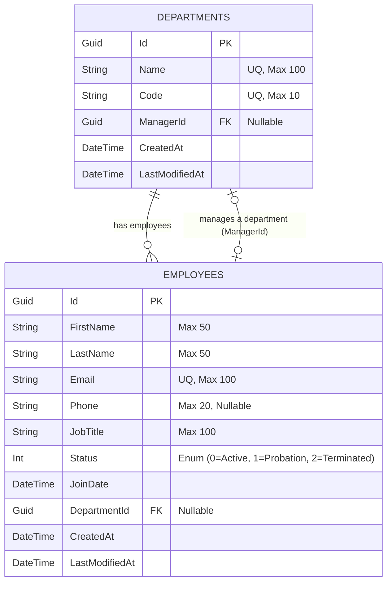

# Database Design Document

This document defines the schema architecture, entity relationships, data dictionary, and indexing strategies for the Enterprise Workforce Management System (EWMS) database.

---

## 1. Entity Relationship Diagram (ERD)

The following diagram illustrates the structural relations between Employees, Departments, Users, and Roles.

*Note: In Sprint 2, we will introduce the security layer (`Users`, `Roles`, `Permissions`, and `AuditLogs` tables) to control authentication and authorization interfaces.*

---

## 2. Data Dictionary

### Table: `Departments`
Stores metadata and leadership relations for organizational departments.

| Column Name | Data Type | Nullability | Constraints | Description |
| :--- | :--- | :--- | :--- | :--- |
| `Id` | `uniqueidentifier` | NOT NULL | PRIMARY KEY | Unique identifier (Guid). |
| `Name` | `nvarchar(100)` | NOT NULL | UNIQUE | Complete name (e.g., "Engineering"). |
| `Code` | `nvarchar(10)` | NOT NULL | UNIQUE | Abbreviation (e.g., "ENG"). |
| `ManagerId` | `uniqueidentifier` | NULL | FOREIGN KEY | References `Employees.Id`. |
| `CreatedAt` | `datetime2` | NOT NULL | DEFAULT(GETUTCDATE()) | Record creation timestamp. |
| `LastModifiedAt` | `datetime2` | NULL | - | Last modification timestamp. |

---

### Table: `Employees`
Stores personal and professional information of active, trial, or former employees.

| Column Name | Data Type | Nullability | Constraints | Description |
| :--- | :--- | :--- | :--- | :--- |
| `Id` | `uniqueidentifier` | NOT NULL | PRIMARY KEY | Unique identifier (Guid). |
| `FirstName` | `nvarchar(50)` | NOT NULL | - | Employee first name. |
| `LastName` | `nvarchar(50)` | NOT NULL | - | Employee last name. |
| `Email` | `nvarchar(100)` | NOT NULL | UNIQUE | Corporate email address. |
| `Phone` | `nvarchar(20)` | NULL | - | Personal telephone number. |
| `JobTitle` | `nvarchar(100)` | NOT NULL | - | Official job role. |
| `Status` | `int` | NOT NULL | - | Enum mapping: 0=Active, 1=Probation, 2=Terminated. |
| `JoinDate` | `date` | NOT NULL | - | Date when employee joined. |
| `DepartmentId` | `uniqueidentifier` | NULL | FOREIGN KEY | References `Departments.Id` (Cascades set to NULL). |
| `CreatedAt` | `datetime2` | NOT NULL | DEFAULT(GETUTCDATE()) | Record creation timestamp. |
| `LastModifiedAt` | `datetime2` | NULL | - | Last modification timestamp. |

---

## 3. Database Constraints & Referential Integrity
- **Foreign Key Actions**:
  - `Employees.DepartmentId` -> `Departments.Id`: `ON DELETE SET NULL`. If a department is deleted (once verified empty), employee records remain intact but their department association is cleared.
  - `Departments.ManagerId` -> `Employees.Id`: `ON DELETE SET NULL`. If an employee who is a manager leaves or is deleted, the department manager field becomes null.
- **Domain Invariants & Unique Keys**:
  - Uniqueness is enforced on `Employees.Email` to ensure logins are distinct.
  - Uniqueness is enforced on `Departments.Name` and `Departments.Code` to prevent duplicate department directory segments.

---

## 4. Indexing Strategy

To maintain sub-200ms query performance as database rows scale, we will establish the following indexes:

1. **Clustered Indexes**: Automatically generated on primary keys (`Departments.Id`, `Employees.Id`).
2. **Non-Clustered Indexes**:
   - `IX_Employees_Email` (Unique): Created automatically by the unique constraint. Ensures instantaneous lookups during user login or verification.
   - `IX_Employees_LastName_FirstName`: Created to optimize directories sorted or filtered by name.
   - `IX_Employees_DepartmentId`: Created on the foreign key column to optimize joins when loading lists of department employees.
   - `IX_Departments_Name` (Unique): Optimizes query lookups for department validation.
