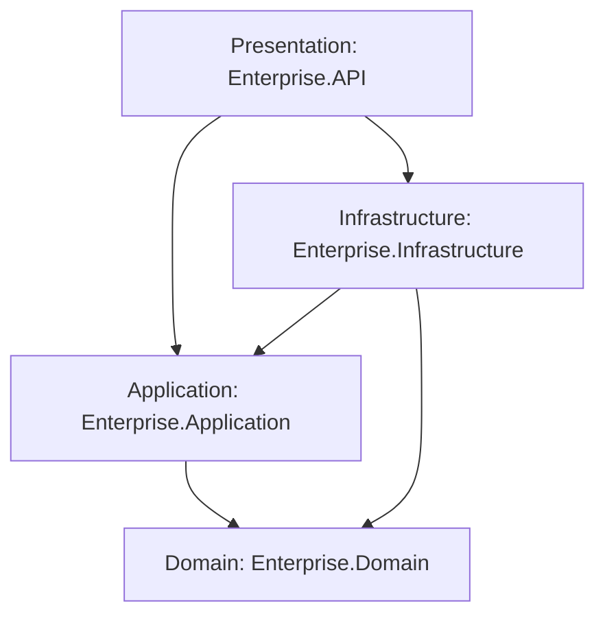

# Enterprise Workforce Management System - Phased Implementation Plan

This implementation plan outlines the strategy, architecture, and step-by-step execution path for building the Enterprise Workforce Management System (EWMS) using a professional software engineering process. Our goal is to establish a rock-solid, production-grade clean architecture foundation while ensuring 100% understanding of every design pattern, framework feature, and line of code.

## User Review Required

Please review the proposed step-by-step approach and the initial architecture setup. We will proceed iteratively, completing one micro-step at a time. Each micro-step will include a detailed explanation of the architecture decisions and code lines before moving to the next.

> [!IMPORTANT]
> To ensure **100% code understanding**, we will adopt a "TDD/DDD & Mentorship" approach:
> 1. For each feature, we will first discuss the domain requirements and architectural pattern.
> 2. I will write clean, well-documented code and provide a breakdown of *why* it is written that way, including EF Core queries, RxJS pipelines, or clean architecture boundaries.
> 3. We will run tests and verify the code before moving to the next step.

## Open Questions

Before we create the file structure, please clarify:
1. **Database Provider**: You mentioned SQL Server. Should we use a local SQL Express/Developer instance, or should we set up a Docker container running SQL Server immediately for our local development environment? (Docker is recommended for consistency).
2. **Angular Version**: Which version of Angular and Angular Material would you like to use for the frontend? (e.g., Angular 18/19 with standalone components).
3. **Repository Initialization**: Do you want me to generate the initial folder structure (`docs/`, `backend/`, `frontend/`, `deployment/`, etc.) first, and then create the ASP.NET Core solution and Angular workspace?

---

## Proposed Architectural Foundation

We will follow **Clean Architecture** principles to separate concerns, ensure testability, and keep the domain logic decoupled from external frameworks and database concerns.

### Clean Architecture Layers
- **Domain (`Enterprise.Domain`)**: Core enterprise business rules, entities, value objects, exceptions, and repository interfaces. No external dependencies except system libraries.
- **Application (`Enterprise.Application`)**: Application business rules, CQRS handlers (MediatR), DTOs, FluentValidation validators, mapping profiles, and port definitions.
- **Infrastructure (`Enterprise.Infrastructure`)**: External concerns like EF Core DbContext, repository implementations, email services, identity providers, and logging.
- **Presentation (`Enterprise.API`)**: ASP.NET Core 9 Web API, controllers/endpoints, filters, middleware (auth, error handling), and Swagger configuration.

---

## Proposed Step-by-Step Roadmap (Phase 1)

Here is how we will proceed step-by-step:

### Step 1: Initial Folder and Solution Setup
- **Objective**: Establish the folder structure and initialize the projects.
- **Tasks**:
  - Create standard folder structure.
  - Create the .NET 9 Solution (`EnterpriseWorkforce.sln`) with the five projects:
    - `Enterprise.Domain` (Class Library)
    - `Enterprise.Application` (Class Library)
    - `Enterprise.Infrastructure` (Class Library)
    - `Enterprise.Shared` (Class Library for shared utilities)
    - `Enterprise.API` (Web API)
  - Configure project references to enforce the clean architecture directional dependencies.
  - Initialize the Angular workspace in the `frontend` folder using `npx -y @angular/cli`.

### Step 2: Domain Layer Modeling
- **Objective**: Design the rich domain model for authentication, roles, employees, and departments.
- **Tasks**:
  - Create base classes like `Entity`, `AggregateRoot`, and `AuditableEntity`.
  - Design Domain Entities: `User`, `Role`, `Permission`, `Employee`, `Department`.
  - Discuss Domain-Driven Design (DDD) principles (Value Objects, Entity invariants, Encapsulation).

### Step 3: Persistence and Base Infrastructure Setup
- **Objective**: Connect the application to SQL Server using EF Core and configure base services.
- **Tasks**:
  - Configure EF Core DbContext in `Enterprise.Infrastructure`.
  - Map entities using Fluent API configurations.
  - Configure EF migrations and seed initial data (Roles, Permissions, admin user).
  - Setup logging with Serilog and error handling middleware.

### Step 4: JWT Authentication and Security
- **Objective**: Establish JWT token generation, verification, and refresh token support.
- **Tasks**:
  - Setup ASP.NET Core Identity (or custom Identity mapping for granular control).
  - Implement JWT token generation, Refresh Token rotation, and Password Hashing.
  - Create authentication endpoints (`/login`, `/refresh`, `/register`, `/verify-email`).
  - Add Role-Based Access Control (RBAC) with granular permissions.

### Step 5: MediatR and CQRS in the Application Layer
- **Objective**: Introduce CQRS pattern to keep application logic decoupled.
- **Tasks**:
  - Implement MediatR for commands and queries.
  - Add FluentValidation pipeline behaviors to automatically validate incoming requests.
  - Add AutoMapper profiles for mapping between Entities and DTOs.

### Step 6: Employee and Department CRUD (API & Logic)
- **Objective**: Implement clean, tested endpoints for employees and departments.
- **Tasks**:
  - Build endpoints for creating, retrieving, updating, and deleting employees/departments.
  - Implement search, pagination, and sorting for employees.

### Step 7: Angular Frontend Setup & Layout
- **Objective**: Build the Angular foundation with layout, routing, and guards.
- **Tasks**:
  - Setup basic styling system with CSS variables (sleek dark mode / modern light mode).
  - Design Core layout (Sidebar, Navbar, Main Content area) using Angular Material.
  - Implement Auth guard and login screen.

### Step 8: Frontend Feature Modules & Dashboard
- **Objective**: Integrate backend APIs and present dashboard visual charts.
- **Tasks**:
  - Implement services to connect to backend endpoints (Employee, Department, Auth).
  - Create lists, forms, and detail views for Employees and Departments.
  - Create Dashboard component with metrics and charts (e.g., using Chart.js or ngx-charts).

---

## Verification Plan

### Automated Tests
- **Backend Unit Tests**: We will create unit tests for domain entities, validators, and CQRS handlers under a `tests/` directory.
- **Backend Integration Tests**: Test actual endpoints using `WebApplicationFactory` and in-memory or Docker database instances.

### Manual Verification
- **Swagger UI**: Verify API endpoints, request/response validation, and authorization headers.
- **Angular Dev Server**: Verify responsive design, layout styling, and interaction flows.
